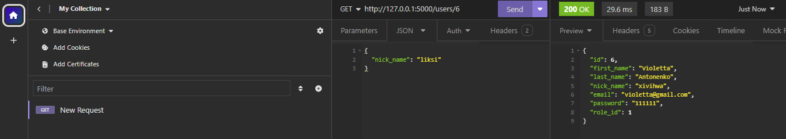
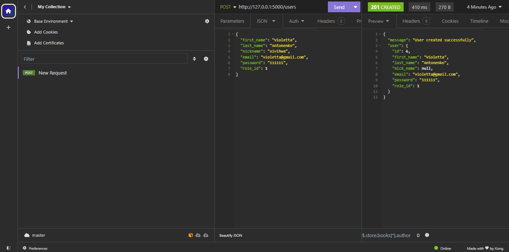

# Тестування працездатності системи

## Засоби тестування
Тестування CRUD застосунку проводиться за допомогою online Postman.

Примітка: Перед цим необхідно інсталювати Postman Agent, щоб тестувати запроси на локальному сервері.

### Отримання інформації по всім User - ам

### Отримання інформації по id Usera

### Створення нового юзера

#### Помилка створення юзера по причині: "Така пошта вже існує"

### Видалення юзеру

#### Помилка видалення юзеру по причині: "Такого юзеру не знайдено"

### Оновлення юзеру

### Вміст таблиці 'User' у базі 'quiz' даних до видалення юзеру

### Вміст таблиці 'User' у базі 'quiz' даних після видалення юзеру

